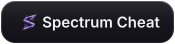

<a href="https://zpu.lol">
  <picture>
    <source media="(prefers-color-scheme: dark)" srcset="assets/hero-dark.svg" />
    <source media="(prefers-color-scheme: light)" srcset="assets/hero-light.svg" />
    
  </picture>
</a>

 

  <a href="https://zpu.lol"><picture><source media="(prefers-color-scheme: light)" srcset="assets/links/zpu-lol-light.svg" /></picture></a>
  <a href="https://spectrumcheat.com"><picture><source media="(prefers-color-scheme: light)" srcset="assets/links/spectrum-cheat-light.svg" /></picture></a>
  <a href="https://www.youtube.com/@xZPUHigh"><picture><source media="(prefers-color-scheme: light)" srcset="assets/links/youtube-light.svg" /></picture></a>
  <a href="https://discord.gg/C3MpUNwsDU"><picture><source media="(prefers-color-scheme: light)" srcset="assets/links/discord-light.svg" /></picture></a>
  <a href="https://www.instagram.com/zpu.mnn2"><picture><source media="(prefers-color-scheme: light)" srcset="assets/links/instagram-light.svg" /></picture></a>
  <a href="https://www.tiktok.com/@xzpuhigh"><picture><source media="(prefers-color-scheme: light)" srcset="assets/links/tiktok-light.svg" /></picture></a>

 

## Stack

<table>
  <tr>
    <td width="160"><b>Languages</b></td>
    <td>
      <picture>
        <source media="(prefers-color-scheme: light)" srcset="https://skillicons.dev/icons?i=ts,js,lua,py,cs,cpp,go,rust,php,bash,html,css&theme=light&perline=12" />
        
      </picture>
    </td>
  </tr>
  <tr>
    <td><b>Frontend</b></td>
    <td>
      <picture>
        <source media="(prefers-color-scheme: light)" srcset="https://skillicons.dev/icons?i=react,nextjs,svelte,tailwind&theme=light" />
        
      </picture>
    </td>
  </tr>
  <tr>
    <td><b>Backend and data</b></td>
    <td>
      <picture>
        <source media="(prefers-color-scheme: light)" srcset="https://skillicons.dev/icons?i=nodejs,bun,deno,express,supabase,postgres,mysql,mongodb,redis,sqlite&theme=light" />
        
      </picture>
    </td>
  </tr>
  <tr>
    <td><b>Infrastructure</b></td>
    <td>
      <picture>
        <source media="(prefers-color-scheme: light)" srcset="https://skillicons.dev/icons?i=cloudflare,vercel,docker,ubuntu,git,github,vscode&theme=light" />
        
      </picture>
    </td>
  </tr>
  <tr>
    <td><b>Reverse engineering</b></td>
    <td>Ghidra · radare2 · Frida · x64dbg · GDB · Wireshark · Burp Suite · Metasploit</td>
  </tr>
  <tr>
    <td><b>Creative</b></td>
    <td>Photoshop · Premiere Pro · DaVinci Resolve · VEGAS Pro · CapCut · Canva · ibisPaint</td>
  </tr>
  <tr>
    <td><b>Spoken</b></td>
    <td>Thai and English, with some Chinese, Vietnamese, Spanish and Japanese</td>
  </tr>
</table>

 

<picture>
  <source media="(prefers-color-scheme: dark)" srcset="assets/footer-dark.svg" />
  <source media="(prefers-color-scheme: light)" srcset="assets/footer-light.svg" />
  
</picture>
