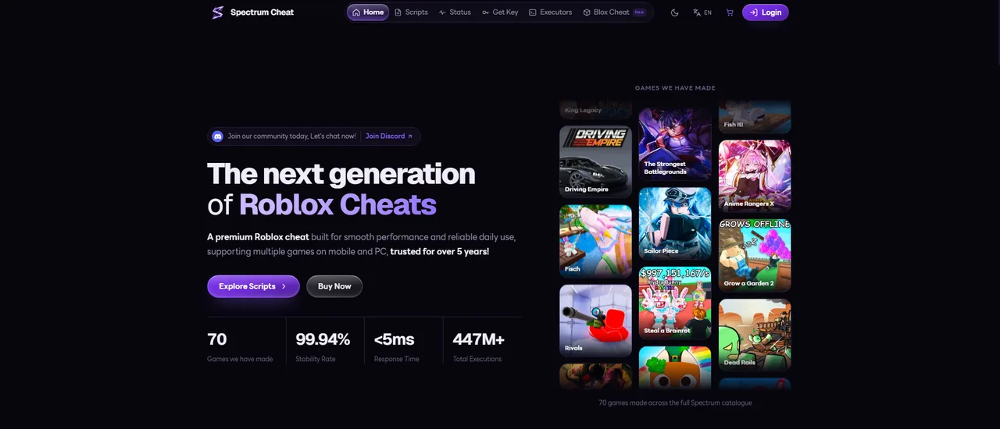
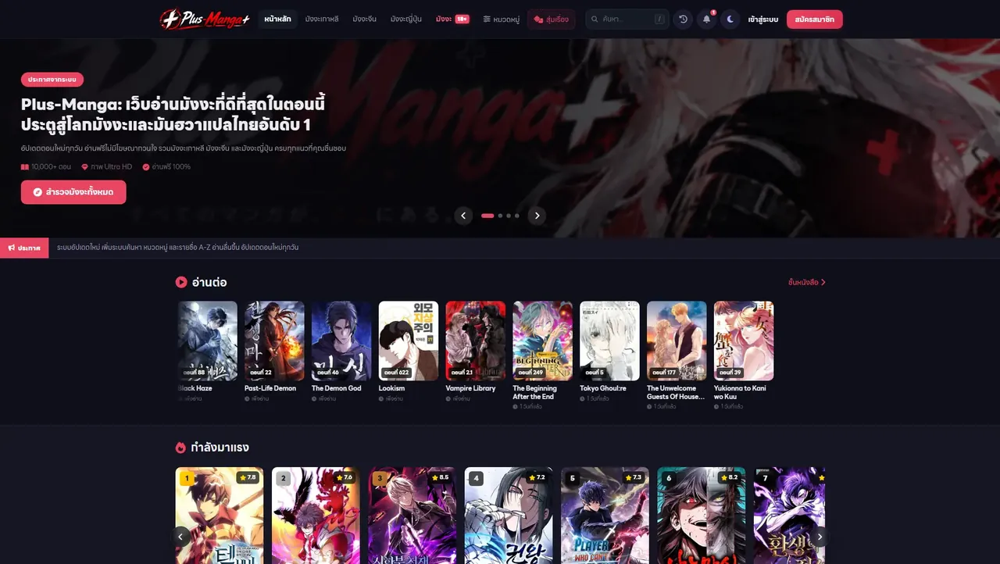
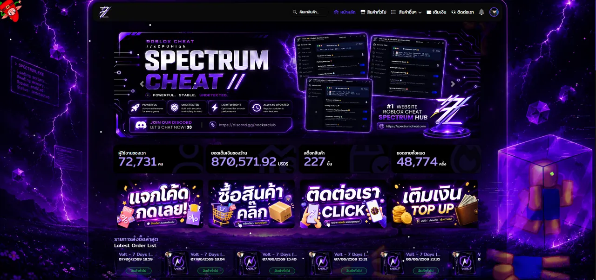
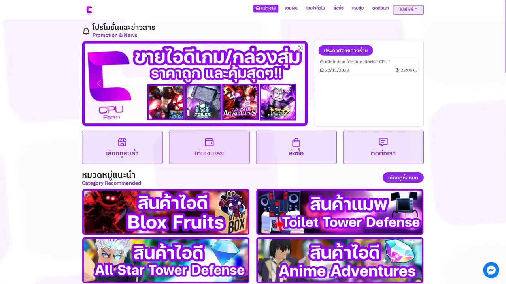

<a href="https://zpu.lol">
  <picture>
    <source media="(prefers-color-scheme: dark)" srcset="assets/hero-dark.svg" />
    <source media="(prefers-color-scheme: light)" srcset="assets/hero-light.svg" />
    
  </picture>
</a>

  <a href="https://zpu.lol"><b>zpu.lol</b></a>
  &nbsp;&middot;&nbsp;
  <a href="https://spectrumcheat.com">Spectrum Cheat</a>
  &nbsp;&middot;&nbsp;
  <a href="https://www.youtube.com/@xZPUHigh">YouTube</a>
  &nbsp;&middot;&nbsp;
  <a href="https://discord.gg/C3MpUNwsDU">Discord</a>
  &nbsp;&middot;&nbsp;
  <a href="https://www.instagram.com/zpu.mnn2">Instagram</a>
  &nbsp;&middot;&nbsp;
  <a href="https://www.tiktok.com/@xzpuhigh">TikTok</a>

 

## About

My name is **Chanon**, or **ZPU** (said like CPU). I started at eight, on a phone I bought myself with almost a year of saved lunch money, and on **9 April 2017** I opened my first YouTube channel along with the first dream I ever had: a hundred thousand subscribers

Everything after that was self taught, one thing at a time. Content first, then selling and taking jobs inside games, and in **2021** writing code: I founded a community of my own, learned **Lua and Luau** from English documentation and other people's source, and built **ZPU HUB**, which grew into **Spectrum** in 2024

Today I am 17 and still one person behind all of it. I write the scripts, build the sites, cut the videos and answer the questions

 

## In numbers

<picture>
  <source media="(prefers-color-scheme: dark)" srcset="assets/stats-dark.svg" />
  <source media="(prefers-color-scheme: light)" srcset="assets/stats-light.svg" />
  
</picture>

 

## The road so far

<picture>
  <source media="(prefers-color-scheme: dark)" srcset="assets/timeline-dark.svg" />
  <source media="(prefers-color-scheme: light)" srcset="assets/timeline-light.svg" />
  
</picture>

<b>Read every year</b>

 

**2017 · The first upload** Content creator 
Opened a channel at eight. The first video was unedited Minecraft with no thumbnail and got forty views, most of them probably me rewatching it

**2018 · First real money** In-game trader 
Grew the biggest farm on a Minecraft server, then someone asked to buy the currency. Five thousand baht at nine years old, and the first proof a game could pay

**2019 · The first shop** Shop owner 
Opened CPU FARM, taking paid farming jobs in Roblox, until it was clear one weak laptop could only farm one account at a time

**2020 · Working during the pandemic** Shop owner 
School closed, so the shop moved to Shinobi Life 2. One to three thousand baht a week, at eleven

**2021 · First code, first community** Self taught developer 
Founded the Discord a day after turning twelve, then learned to write scripts. Ten thousand members inside three months, and by December a hub of my own, starting with Mad City

**2022 · Paid for the first time** Creator, and the cost of it 
Two to three uploads a day, the first million views, and after four years of work the first 4,000 baht from YouTube. The same year the throat gave out

**2023 · The mystery box business** Shop owner again 
The first ten thousand subscribers, and the old shop came back as mystery boxes. Eight months of that cleared 156,000 baht

**2024 · Spectrum** Founder 
Fisch put the hub on foreign screens and the Discord passed a hundred thousand. The hub became Spectrum, sixty-seven games deep, all of it still one person

**2025 · The year I felt low** Away from the camera 
The worst wave of drama I had taken. A month without uploading, then the year closed on 420,000 baht, the largest sum I have made

**2026 · Where things stand** Still shipping 
Left school after the year ten finals and wrote [zpu.lol](https://zpu.lol). Still running Spectrum

 

## Work

<table>
  <tr>
    <td width="50%" valign="top">
      
      <h3><a href="https://spectrumcheat.com">Spectrum Cheat</a></h3>
      
A premium Roblox cheat platform, on mobile and PC. Accounts, a hardened OTP reset and push to main deploys on Cloudflare Workers

      Next.js · TypeScript · Cloudflare Workers · Supabase · Drizzle ORM · Resend 
      <b>Live</b> · 2025 to now
    </td>
    <td width="50%" valign="top">
      
      <h3><a href="https://plus-manga.com">Plus Manga</a></h3>
      
A reading platform for manhwa, manhua and manga. Live search across sources, a personal bookshelf and new chapter alerts

      Next.js · React · Cloudflare Workers · Cloudflare D1 
      <b>Live</b> · 2025 to now
    </td>
  </tr>
  <tr>
    <td width="50%" valign="top">
      
      <h3><a href="https://spectrumcheat.rexzy.xyz">Spectrum Store</a></h3>
      
The storefront behind everything else. Payments, stock and key delivery for the platform

      <b>Live</b> · 2024 to now
    </td>
    <td width="50%" valign="top">
      
      <h3>CPU FARM</h3>
      
A farming shop, open from 2019 to 2024. Everything learned here went into the storefront that replaced it

      <b>Archived</b> · 2019 to 2024
    </td>
  </tr>
</table>

<a href="https://zpu.lol/projects">Every project on zpu.lol</a>

 

## Stack

<table>
  <tr>
    <td width="160"><b>Languages</b></td>
    <td>
      <picture>
        <source media="(prefers-color-scheme: light)" srcset="https://skillicons.dev/icons?i=ts,js,lua,py,cs,cpp,go,rust,php,bash,html,css&theme=light&perline=12" />
        
      </picture>
    </td>
  </tr>
  <tr>
    <td><b>Frontend</b></td>
    <td>
      <picture>
        <source media="(prefers-color-scheme: light)" srcset="https://skillicons.dev/icons?i=react,nextjs,svelte,tailwind&theme=light" />
        
      </picture>
    </td>
  </tr>
  <tr>
    <td><b>Backend and data</b></td>
    <td>
      <picture>
        <source media="(prefers-color-scheme: light)" srcset="https://skillicons.dev/icons?i=nodejs,bun,deno,express,supabase,postgres,mysql,mongodb,redis,sqlite&theme=light" />
        
      </picture>
    </td>
  </tr>
  <tr>
    <td><b>Infrastructure</b></td>
    <td>
      <picture>
        <source media="(prefers-color-scheme: light)" srcset="https://skillicons.dev/icons?i=cloudflare,vercel,docker,ubuntu,git,github,vscode&theme=light" />
        
      </picture>
    </td>
  </tr>
  <tr>
    <td><b>Reverse engineering</b></td>
    <td>Ghidra · radare2 · Frida · x64dbg · GDB · Wireshark · Burp Suite · Metasploit</td>
  </tr>
  <tr>
    <td><b>Creative</b></td>
    <td>Photoshop · Premiere Pro · DaVinci Resolve · VEGAS Pro · CapCut · Canva · ibisPaint</td>
  </tr>
  <tr>
    <td><b>Spoken</b></td>
    <td>Thai and English, with some Chinese, Vietnamese, Spanish and Japanese</td>
  </tr>
</table>

 

## Writing

- [I learned to code before AI, and now I use it every day](https://zpu.lol/blog/docs-before-ai)
- [A password reset that does more than send six digits](https://zpu.lol/blog/otp-that-holds)
- [Moving Next.js off Vercel and onto Cloudflare Workers](https://zpu.lol/blog/vercel-to-workers)
- [Keeping sixty-seven games working without fixing them one at a time](https://zpu.lol/blog/shipping-67-maps)

<a href="https://zpu.lol/blog">Everything on the blog</a>

 

<picture>
  <source media="(prefers-color-scheme: dark)" srcset="assets/footer-dark.svg" />
  <source media="(prefers-color-scheme: light)" srcset="assets/footer-light.svg" />
  
</picture>
